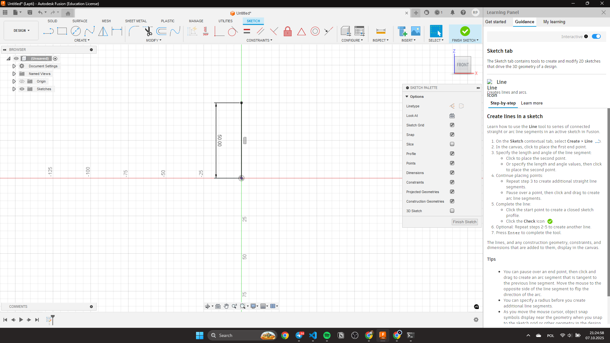

# Деталь "ялинка" для 3д принтер

## Інструкція для створення в Autodesk Fusion 360*
1. На порожній вкладці оберемо Create Sketch та оберемо площину Front 
2. Проведемо вгору лінію довжиною 50мм 
3. Під кутом 40-45 градусів проведемо лінію вліво вниз довжиною приблизно
30мм
4. Паралельно до осі Х проведемо лінію вправо довжиною приблизно 8мм.
Має вийти щось схоже на скріншот знизу 
5. Повторити ці самі дії ще 2 рази, нижні гілки можна робити під більшим кутом та більшої довжини, головне лишати однакову товщину стовбура. Має вийти так 
6. Провести лінію вертикально вниз до осі Х
7. Замкнути контур та натиснути Finish Sketch 
8. Обрати інструмент Revolve
9. Виділити скетч, вісь Z та обрати такі параметри як на скріншоті 
10. Готова деталь 
11. File -> Export -> обрати потрібний формат

[Готовий файл](Artifacts/Lapti%20yolka.dxf)

_* - вважається, що ви вже маєте встановлений Fusion з підходящою ліцензією_
