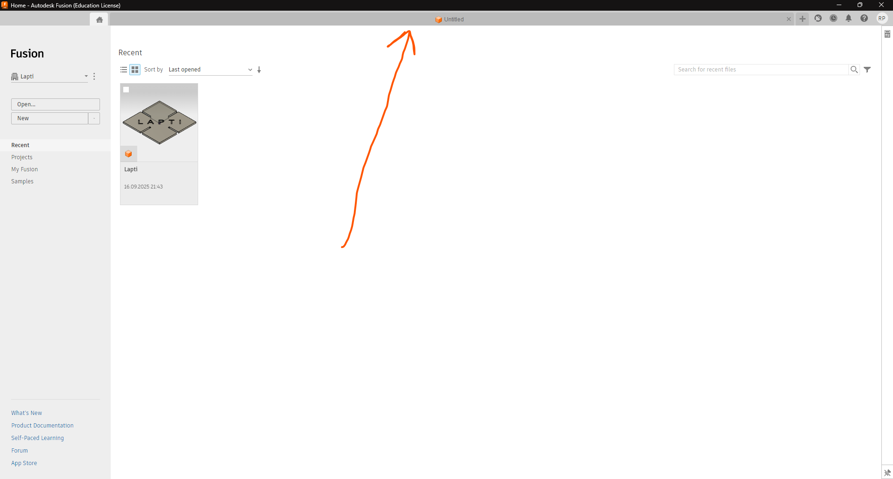
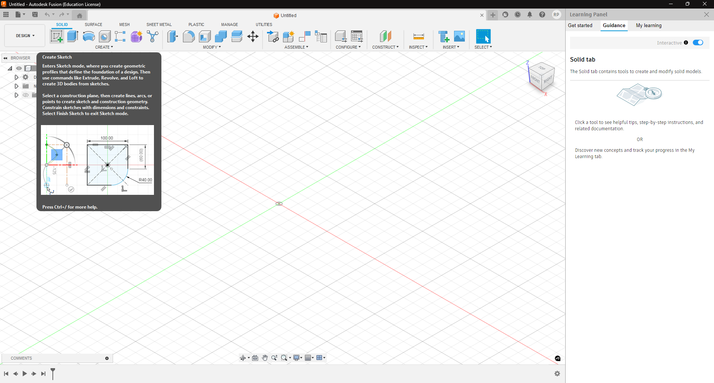
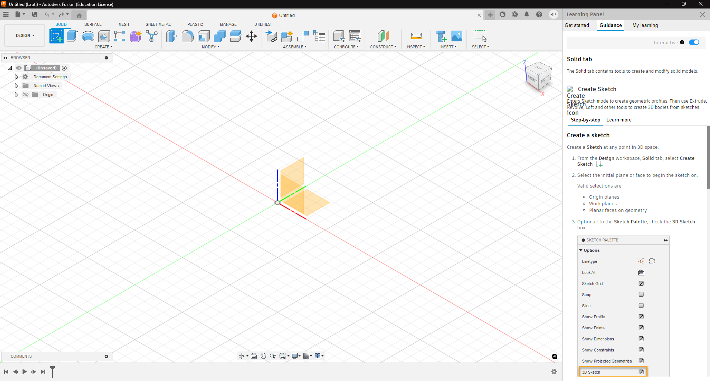
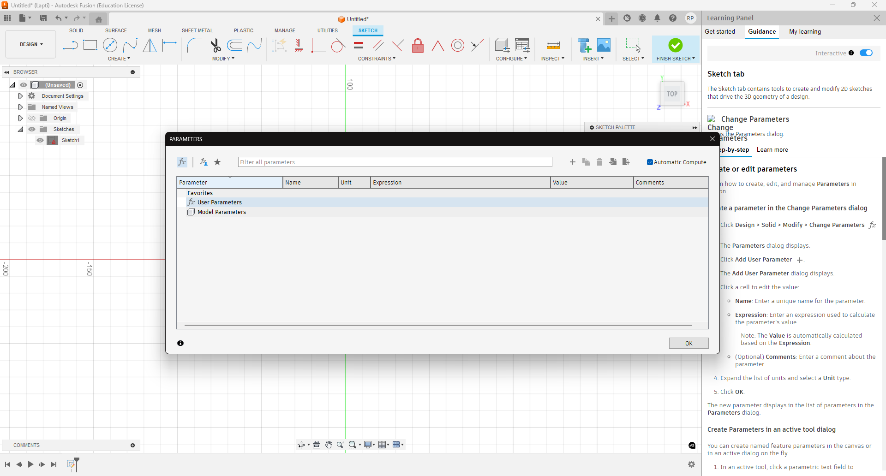
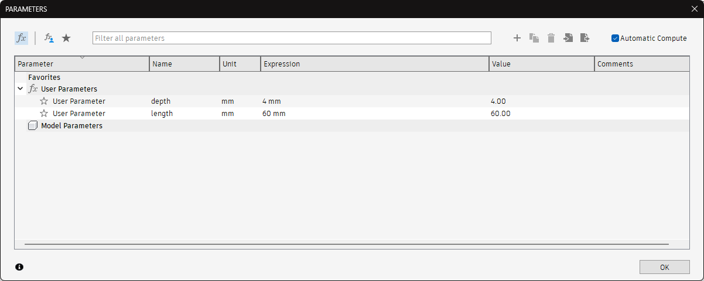
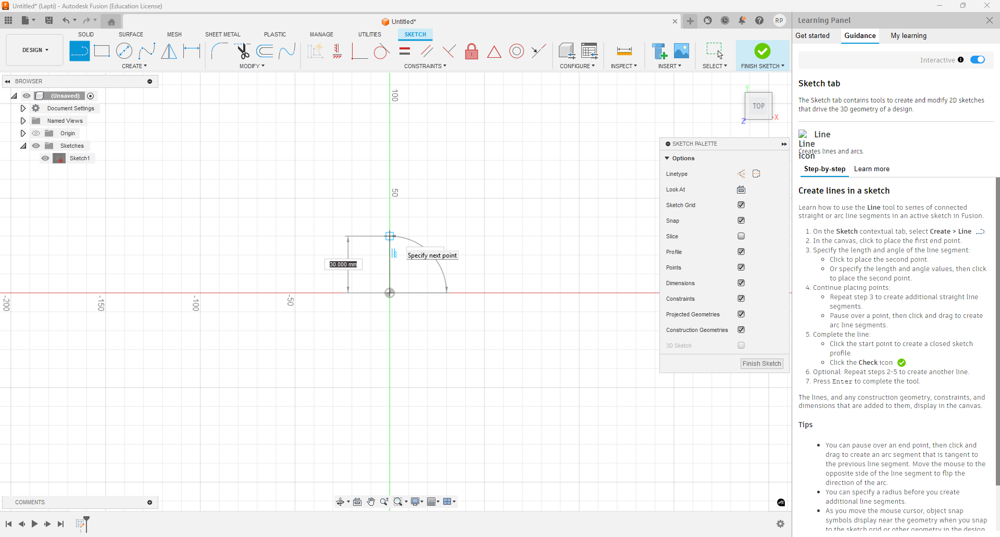
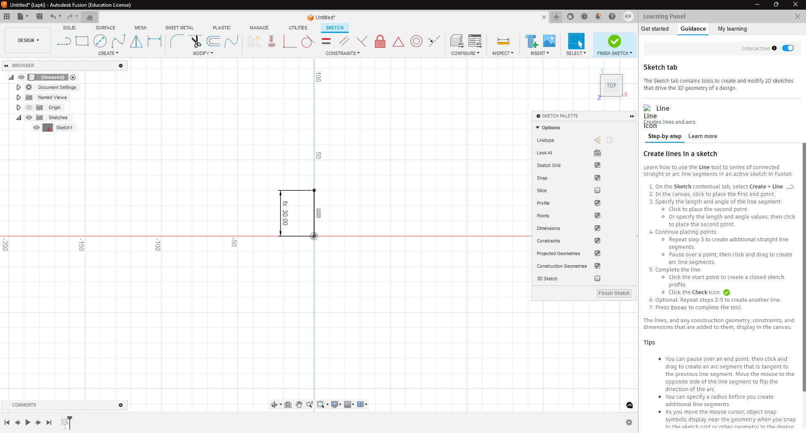

# Деталь "сніжинка" для лазерного різака

## Інструкція до створення в Autodesk Fusion 360
### Спочатку створимо скетч четвертини фігури
1. Завантажити Fusion із навчальною або персональною **не безкоштовною** ліцензією
2. Перейти на порожню вкладку
3. Натиснути Create Sketch 
4. Обрати площину скетча (я обрав площину xOy)
5. Далі задаємо параметри, для цього переходимо в меню Modify -> Change Parameters 
6. Вводимо такі параметри, як на скріншоті нижче, у розділ User Paramteres 
7. Обираємо Create Line, та починаємо вести лінію від початку координат вгору 
8. У значення довжини лінії вводимо вираз length/2 та маємо наступний результат 
9. Далі тим же інструментом від кінця створеної нами лінії проводимо вправо на depth/2 
10. Проводимо лінію вгору на length/2
11. Проводимо лінію вправо на length - depth/2
12. Проводимо лінію вниз на length - depth/2
13. Проводимо лінію вліво на length/2
14. Проводимо лінію вниз на depth/2
15. Проводимо лінію вліво на length/2

Після цих 15 кроків ми маємо отримати скетч, схожий на той, що на скріншоті  
Отримавши цей скетч, натискаємо Finish Sketch.
### Далі перетворимо скетч у об'ємну фігуру, та зробимо повний виріб:
1. Виділяємо скетч лівою кнопкою миші
2. Натискаємо Create -> Extrude
3. В поле distance вводимо depth 
4. Натискаємо ОК та бачимо об'ємну фігуру 
5. Обираємо Create -> Mirror та встановлюємо параметри як на скріншоті 
    Як ми можемо побачити, вже видно прев'ю готового дзеркала, тому відразу буде зрозуміло чи правильно ми все робимо. В цьому випадку все правильно
6. Натискаємо ОК та бачимо половину майбутнього виробу
7. Повторимо крок 5, але з іншою площиною віддзеркалення, щоб вийшло як на скріншоті 

На цьому основна частина створення виробу завершується, можна експортувати нашу модель у потрібний формат файлу
Знайти готовий файл з цією версією виробу можна [тут](Лазерний різак\Artifacts\final_no_text.dxf)

### Додамо вдавлений текст на поверхню виробу для брендування
1. Виділяємо потрібну площину, натискаємо праву кнопку миші та обираємо Create Sketch 
2. Обираємо Create -> Text
3. Виставляємо межі текстового поля
4. Вводимо текст, обираємо потрібні нам параметри, приклад на скріншоті 
5. Натискаємо ОК, далі можемо затиснутою лівою кнопкою миші підлаштувати місцерозташування нашого тексту
6. Натискаємо Finish Sketch
7. Щоб вдавити текст, обираємо текст лівою кнопкою миші та натискаємо Extrude
8. В полі distance вводимо -depth/2 та натискаємо OK
Має вийти як на скріншоті 
Експортуємо нашу модель у потрібний формат. Готовий файл з вдавленим текстом можна знайти [тут](Лазерний різак\Artifacts\final_with_text.dxf)
